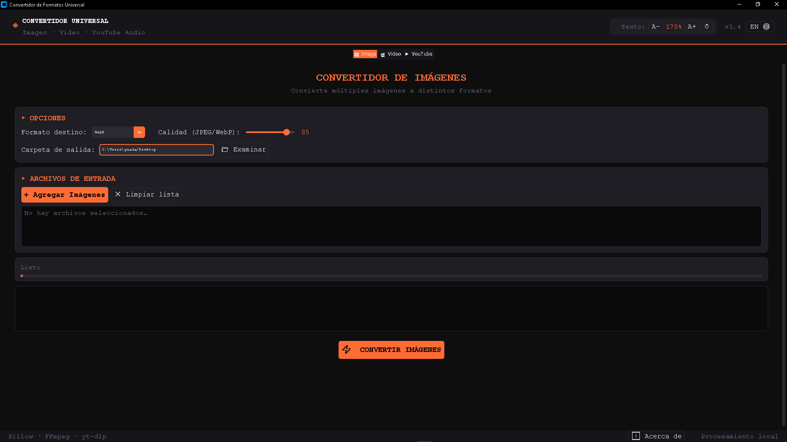
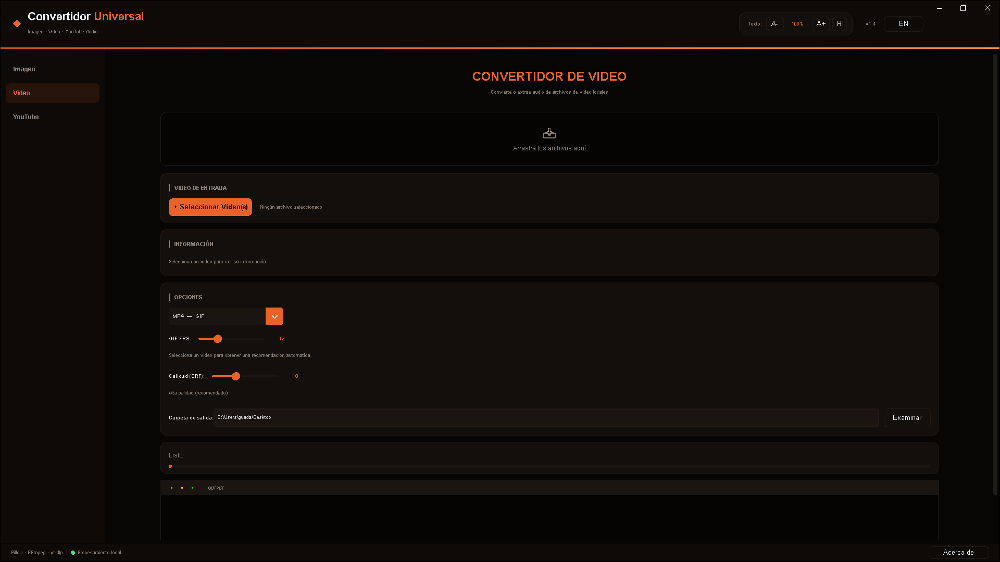
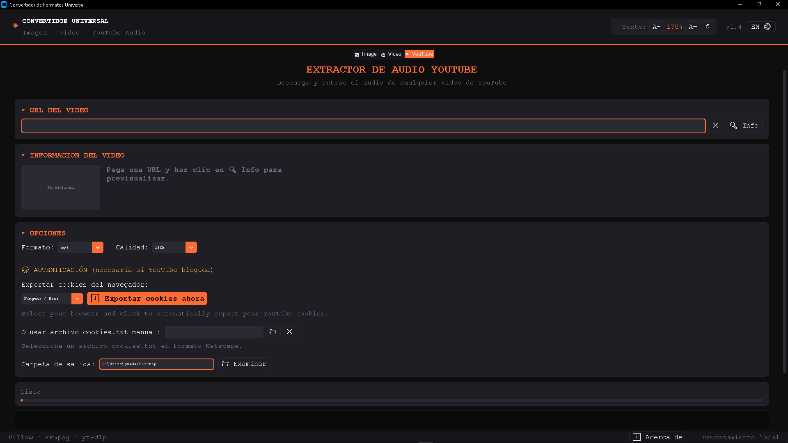
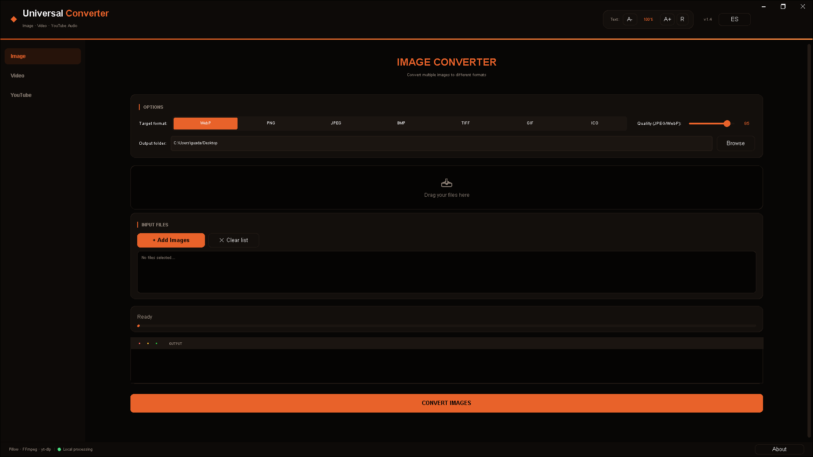
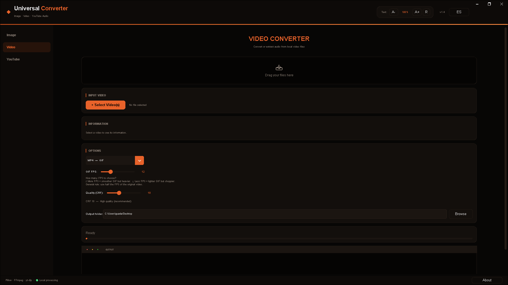
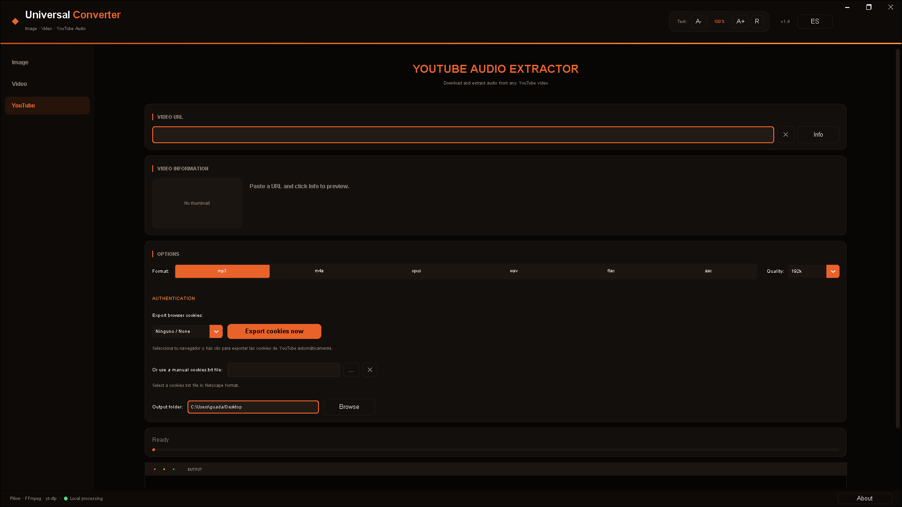

# ◈ Convertidor Universal v1.4

> **ES** — Herramienta de escritorio para conversión de imágenes, videos y descarga de audio desde YouTube. Todo el procesamiento se realiza **localmente**, sin conexión a servidores externos.
>
> **EN** — Desktop tool for converting images, videos, and downloading audio from YouTube. All processing is done **locally**, with no external server connections.


> 💾 **Descargar ejecutable** / **Download executable**: [Releases](https://github.com/HenryXCC/universal-converter/releases)

---

## ES — Español

### Características

- **🖼 Conversión de imágenes** — Convierte entre WebP, PNG, JPEG, BMP, TIFF, GIF e ICO. Soporta conversión por lotes, control de calidad y generación de GIFs animados con previsualización en tiempo real.
- **🎬 Conversión de video** — Convierte entre MP4, AVI, MKV y MOV usando FFmpeg con barra de progreso en vivo y posibilidad de cancelar el proceso.
- **▶ Descarga de audio de YouTube** — Descarga y extrae audio en MP3, M4A, OPUS, WAV, FLAC o AAC con vista previa de miniatura, título, canal y duración.
- **🍪 Exportación de cookies** — Exporta cookies del navegador o usa un archivo cookies.txt para autenticación en YouTube (necesario cuando YouTube bloquea).
- **🌐 Cambio de idioma en vivo** — Alterna entre español e inglés con un clic, sin cerrar ni reiniciar la aplicación. Los archivos cargados, el estado de la conversión y la carpeta de salida se conservan intactos.
- **Interfaz oscura moderna** — Construida con `customtkinter`, escala de texto ajustable y soporte de arrastrar y soltar archivos (Drag & Drop).
- **Configuración persistente** — Recuerda la carpeta de salida, el tamaño de fuente y el idioma entre sesiones (`config.json`).

## 📸 Capturas de pantalla
---







---


### Requisitos previos

**Python** — Versión **3.10 o superior**.

**FFmpeg** (requerido para Video y YouTube) — FFmpeg y FFprobe deben estar instalados en el sistema y disponibles en el `PATH`.

| Sistema | Comando |
|---------|---------|
| Windows | `winget install Gyan.FFmpeg` |
| macOS   | `brew install ffmpeg` |
| Linux   | `sudo apt install ffmpeg` |

Descarga manual: [https://ffmpeg.org/download.html](https://ffmpeg.org/download.html)

### Instalación

```bash
# 1. Clonar el repositorio
git clone https://github.com/HenryXCC/universal-converter.git
cd convertidor-universal

# 2. (Recomendado) Crear entorno virtual
python -m venv venv
source venv/bin/activate        # macOS / Linux
venv\Scripts\activate           # Windows

# 3. Instalar dependencias
pip install -r requirements.txt
```

### Uso

```bash
python main.py
```

Al iniciar, la app detecta automáticamente los binarios de FFmpeg disponibles en el sistema.

**Pestaña YouTube — Cookies**

Si YouTube bloquea las descargas, exporta las cookies de tu navegador desde la pestaña YouTube:
1. Selecciona tu navegador en el menú desplegable.
2. Haz clic en **"⬇ Exportar cookies ahora"**.
3. También puedes cargar manualmente un archivo `cookies.txt` en formato Netscape.

> ⚠ El navegador debe estar **completamente cerrado** antes de exportar las cookies, de lo contrario la base de datos estará bloqueada y la exportación fallará.

**Pestaña Imagen**
1. Haz clic en **"+ Agregar imágenes"** o arrastra archivos a la ventana.
2. Selecciona el **formato de salida** y ajusta la **calidad** (para JPEG/WebP).
3. Elige la **carpeta de destino** y pulsa **"⚡ CONVERTIR IMÁGENES"**.

Para crear un **GIF animado**, selecciona el formato GIF, ordena los fotogramas con las flechas ↑↓ y ajusta el delay entre frames. La vista previa animada se actualiza en tiempo real.

**Pestaña Video**
1. Agrega uno o más archivos de video (o arrástralos a la ventana).
2. Selecciona el **formato de salida**. Para conversión a GIF, ajusta los FPS con el control deslizante — la app te muestra automáticamente los FPS del video fuente y el valor recomendado.
3. Pulsa **"⚡ CONVERTIR VIDEO(S)"**. Puedes cancelar el proceso en cualquier momento.

**Pestaña YouTube**
1. Pega la URL de un video de YouTube.
2. Haz clic en **"🔍 Info"** para previsualizar el video (miniatura, canal, duración, vistas y likes).
3. Elige el **formato de audio** y la **calidad en kbps**.
4. Pulsa **"⬇ DESCARGAR AUDIO"**.

**Cambio de idioma**

Haz clic en el botón **`EN 🌐`** en la esquina superior derecha del header. La interfaz cambia al inglés al instante sin cerrar la app ni perder el trabajo en curso. Vuelve a hacer clic (`ES 🌐`) para regresar al español.

### Ejecutar tests

```bash
python -m pytest tests.py -v
```

Requiere `pytest` instalado: `pip install pytest`

### Crear ejecutable (.exe)

Para distribuir la aplicación como ejecutable independiente, usa [PyInstaller](https://pyinstaller.org/):

```bash
# 1. Instalar PyInstaller (si no lo tienes)
pip install pyinstaller

# 2. Ejecutar el comando para crear el .exe
pyinstaller --onedir --windowed --clean --noconfirm --name "Convertidor Universal" --icon="assets/icon.ico" main.py
```

El ejecutable se generará en la carpeta `dist/Convertidor Universal/`.

### Estructura del proyecto

```
convertidor-universal/
├── main.py              # Punto de entrada (4 líneas)
├── app.py               # Ventana principal, pestañas, DnD, idioma
├── config.py            # Colores, fuentes, FFmpeg, dependencias opcionales
├── i18n.py              # Sistema de traducción ES/EN
├── utils.py             # FFprobe/FFmpeg, escala de fuente, utilidades
├── widgets.py           # Componentes UI reutilizables
├── tests.py             # Suite de tests (56 tests)
├── tabs/
│   ├── image_tab.py     # Pestaña Imagen
│   ├── video_tab.py     # Pestaña Video
│   └── youtube_tab.py   # Pestaña YouTube
├── assets/
│   ├── icon.ico         # Ícono de la aplicación
│   ├── image_tab_es.png # Captura de pantalla ES
│   ├── image_tab_en.png # Captura de pantalla EN
│   ├── video_tab_es.png
│   ├── video_tab_en.png
│   ├── youtube_tab_es.png
│   └── youtube_tab_en.png
├── requirements.txt
├── .gitignore
├── LICENSE
```

### Dependencias

| Paquete | Uso |
|---------|-----|
| `customtkinter` | Interfaz gráfica moderna |
| `Pillow` | Procesamiento de imágenes |
| `FFmpeg` / `FFprobe` | Conversión de video y audio (externo, no pip) |
| `yt-dlp` | Descarga de YouTube |
| `tkinterdnd2` | Drag & Drop de archivos |
| `moviepy` | Detección de FFmpeg (fallback) |

### Notas de compatibilidad

- **Windows**: La ventana de consola se suprime automáticamente durante la conversión (`CREATE_NO_WINDOW`).
- **macOS / Linux**: Compatible. Asegúrate de que FFmpeg esté en el `PATH`.
- El archivo `config.json` se crea automáticamente en el directorio del proyecto al cerrar la aplicación.

---

## EN — English

### Features

- **🖼 Image conversion** — Convert between WebP, PNG, JPEG, BMP, TIFF, GIF and ICO. Supports batch conversion, quality control, and animated GIF generation with real-time preview.
- **🎬 Video conversion** — Convert between MP4, AVI, MKV and MOV using FFmpeg, with a live progress bar and the ability to cancel at any time.
- **▶ YouTube audio download** — Download and extract audio as MP3, M4A, OPUS, WAV, FLAC or AAC, with thumbnail preview, title, channel, and duration.
- **🍪 Cookie export** — Export cookies from your browser or use a manual cookies.txt file for YouTube authentication (required when YouTube blocks downloads).
- **🌐 Live language switching** — Toggle between Spanish and English with one click, without closing or restarting the app. Loaded files, conversion state, and output folder are preserved.
- **Modern dark UI** — Built with `customtkinter`, with adjustable text scaling and Drag & Drop support.
- **Persistent settings** — Remembers output folder, font size, and language between sessions (`config.json`).

## 📸 Screenshots
---







---

### Prerequisites

**Python** — Version **3.10 or higher**.

**FFmpeg** (required for Video and YouTube) — FFmpeg and FFprobe must be installed and available on the system `PATH`.

| System  | Command |
|---------|---------|
| Windows | `winget install Gyan.FFmpeg` |
| macOS   | `brew install ffmpeg` |
| Linux   | `sudo apt install ffmpeg` |

Manual download: [https://ffmpeg.org/download.html](https://ffmpeg.org/download.html)

### Installation

```bash
# 1. Clone the repository
git clone https://github.com/HenryXCC/universal-converter.git
cd convertidor-universal

# 2. (Recommended) Create a virtual environment
python -m venv venv
source venv/bin/activate        # macOS / Linux
venv\Scripts\activate           # Windows

# 3. Install dependencies
pip install -r requirements.txt
```

### Usage

```bash
python main.py
```

On launch, the app automatically detects FFmpeg binaries available on the system.

**YouTube Tab — Cookies**

If YouTube blocks downloads, export cookies from your browser in the YouTube tab:
1. Select your browser from the dropdown menu.
2. Click **"⬇ Export cookies now"**.
3. You can also manually load a `cookies.txt` file in Netscape format.

> ⚠ The browser must be **completely closed** before exporting cookies, otherwise the database will be locked and the export will fail.

**Image Tab**
1. Click **"+ Add Images"** or drag files into the window.
2. Select the **output format** and adjust **quality** (for JPEG/WebP).
3. Choose the **output folder** and click **"⚡ CONVERT IMAGES"**.

To build an **animated GIF**, select the GIF format, reorder frames using the ↑↓ arrows, and adjust the frame delay. The animated preview updates in real time.

**Video Tab**
1. Add one or more video files (or drag them into the window).
2. Select the **output format**. For GIF conversion, use the FPS slider — the app automatically displays the source video's FPS and a recommended value.
3. Click **"⚡ CONVERT VIDEO(S)"**. You can cancel the process at any time.

**YouTube Tab**
1. Paste a YouTube video URL.
2. Click **"🔍 Info"** to preview the video (thumbnail, channel, duration, views, and likes).
3. Choose the **audio format** and **bitrate quality**.
4. Click **"⬇ DOWNLOAD AUDIO"**.

**Language switching**

Click the **`ES 🌐`** button in the top-right corner of the header. The interface switches to Spanish instantly, without closing the app or losing any work in progress. Click again (`EN 🌐`) to switch back to English.

### Running tests

```bash
python -m pytest tests.py -v
```

Requires `pytest` installed: `pip install pytest`

### Building an executable (.exe)

To distribute the application as a standalone executable, use [PyInstaller](https://pyinstaller.org/):

```bash
# 1. Install PyInstaller (if you don't have it)
pip install pyinstaller

# 2. Run the command to create the .exe
pyinstaller --onedir --windowed --clean --noconfirm --name "Convertidor Universal" --icon="assets/icon.ico" main.py
```

The executable will be generated in the `dist/Convertidor Universal/` folder.

### Project structure

```
convertidor-universal/
├── main.py              # Entry point (4 lines)
├── app.py               # Main window, tabs, DnD, language
├── config.py            # Colors, fonts, FFmpeg, optional deps
├── i18n.py              # ES/EN translation system
├── utils.py             # FFprobe/FFmpeg, font scaling, utilities
├── widgets.py           # Reusable UI components
├── tests.py             # Test suite (56 tests)
├── tabs/
│   ├── image_tab.py     # Image tab
│   ├── video_tab.py     # Video tab
│   └── youtube_tab.py   # YouTube tab
├── assets/
│   ├── icon.ico         # App icon
│   ├── image_tab_es.png # Screenshot ES
│   ├── image_tab_en.png # Screenshot EN
│   ├── video_tab_es.png
│   ├── video_tab_en.png
│   ├── youtube_tab_es.png
│   └── youtube_tab_en.png
├── requirements.txt
├── .gitignore
├── LICENSE
```

### Dependencies

| Package | Purpose |
|---------|---------|
| `customtkinter` | Modern graphical interface |
| `Pillow` | Image processing |
| `FFmpeg` / `FFprobe` | Video and audio conversion (external, not pip) |
| `yt-dlp` | YouTube downloading |
| `tkinterdnd2` | File Drag & Drop |
| `moviepy` | FFmpeg detection (fallback) |

### Compatibility notes

- **Windows**: The console window is automatically suppressed during conversion (`CREATE_NO_WINDOW`).
- **macOS / Linux**: Fully supported. Make sure FFmpeg is on your `PATH`.
- `config.json` is created automatically in the project directory when the app is closed.

---

## License / Licencia

Distributed under the **MIT** license. See the `LICENSE` file for details.
Distribuido bajo la licencia **MIT**. Consulta el archivo `LICENSE` para más detalles.

---

*Developed as a portfolio project. All processing is local — no data is sent to external servers.*
*Desarrollado como proyecto de portafolio. Todo el procesamiento es local — no se envía ningún dato a servidores externos.*
